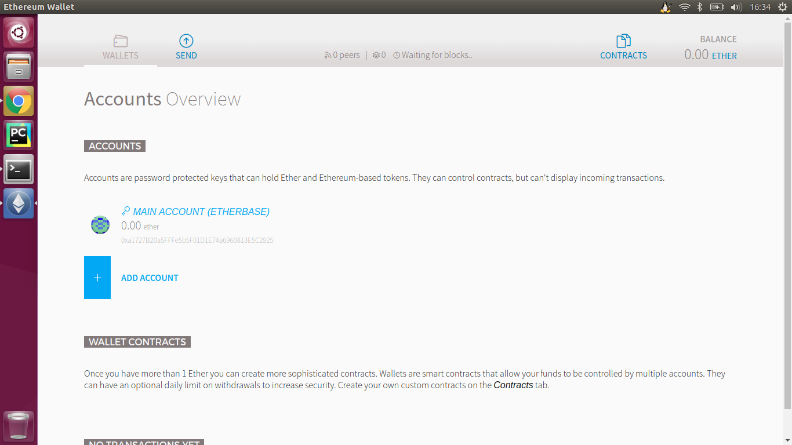
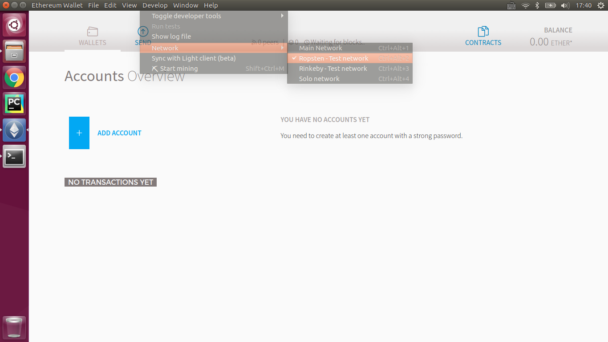
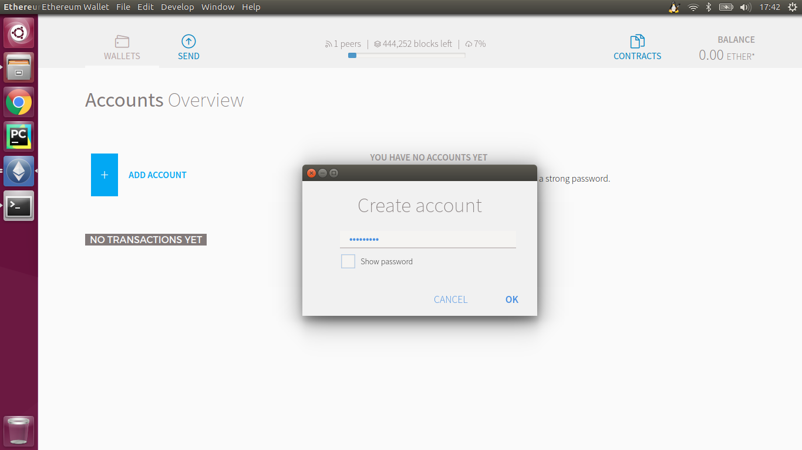
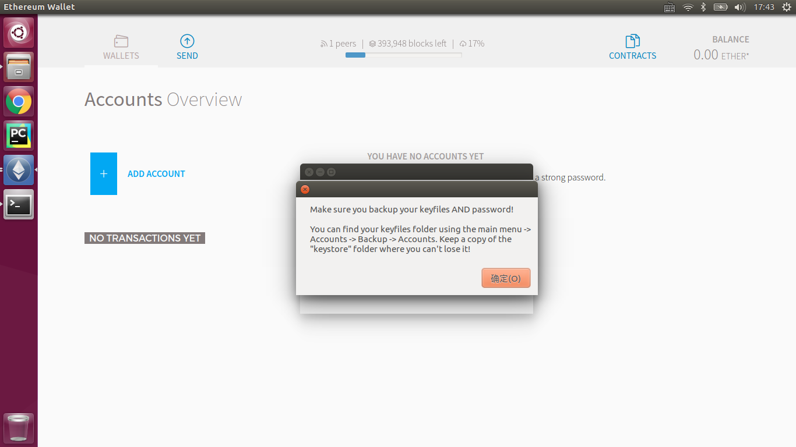
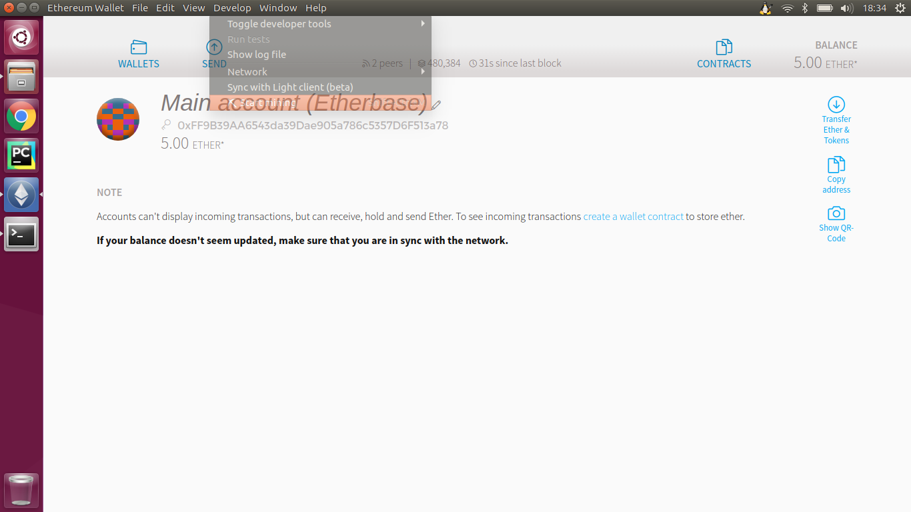
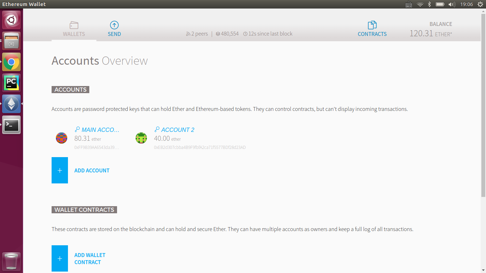

# Ethereum Wallet Testnet

以太坊的英文全称是 Ethereum，以太币的符号是三个横杠（Ξ），也叫 ETH、ether。

以太坊将使用混合型的安全协议，前期使用工作量证明机制（POW），用于分发以太币，然后会切换到权益证明机制（POS）。自上线时起，每年都将有 0.26x，即每年有 60102216 * 0.26 = 15626576 个以太币被矿工挖出。转成 POS 后，每年产出的以太币将减少。

以太币，是以太坊的原生代币，它有两个用途：第一，应用程序（Đapp）需要为他们做出的每一个操作付费，这样可以避免被损坏的或恶意的程序走向失控；第二，对于那些将自己的资源贡献给去中心化网络的人们，以太币是一种奖励。

## Refers

* [关于以太坊，你应该知道的十件事](https://yunbi.zendesk.com/hc/zh-cn/articles/115004887127-%E5%85%B3%E4%BA%8E%E4%BB%A5%E5%A4%AA%E5%9D%8A-%E4%BD%A0%E5%BA%94%E8%AF%A5%E7%9F%A5%E9%81%93%E7%9A%84%E5%8D%81%E4%BB%B6%E4%BA%8B)
* [Ethereum Wallet使用简易教程 - An Introduction for Nov-Developers](http://www.jianshu.com/p/ab8b2c4903c6)
* [Ethereum in practice part 1: how to build your own cryptocurrency without touching a line of code](https://blog.ethereum.org/2015/12/03/how-to-build-your-own-cryptocurrency/)

## Ethereum Wallet

### testnet

* support testnet
  
* create account
  
* create account success
  
* testnet mining
  
* after 30 minites
  

