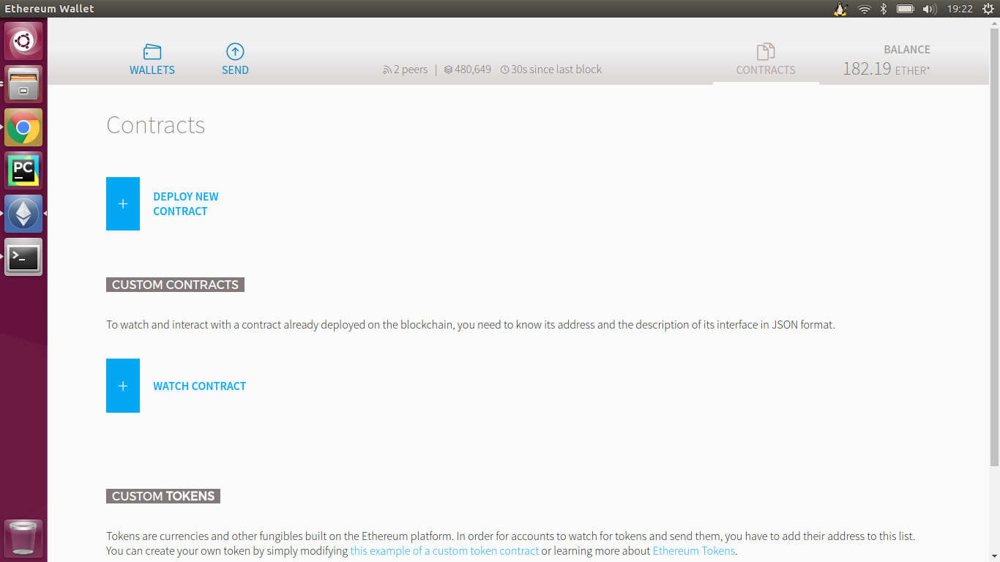
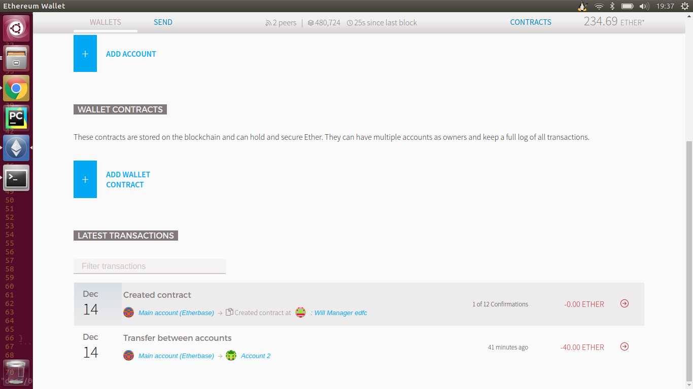

# Ethereum Wallet Deploy New Contract

## Refers

* [Ethereum Wallet使用简易教程 - An Introduction for Nov-Developers](http://www.jianshu.com/p/ab8b2c4903c6)
* [Ethereum in practice part 1: how to build your own cryptocurrency without touching a line of code](https://blog.ethereum.org/2015/12/03/how-to-build-your-own-cryptocurrency/)

## testnet contract



## deploy a contract 

使用参考文档中的代码需要将`send`函数换成`transfer`函数。

```
pragma solidity ^0.4.15;

/// title: Will Manager to for a Non-Devs' Enjoyment!
/// author: Griff Green
/// notice: This Contract gives the user a chance to interact with the  
///blockchain as a novice, it is not actually for Will Validation

contract WillManager {
    /// notice: Making these variables public displays them in the Ethereum Wallet.
    address public willOwner;
    bytes32 public hashOfWill;
    bytes32 public hashOfWillBeingChecked;
    bool public willIsCorrect;
    bool public willCreated;
    address public lastWillChecker;
    
    /// notice: This function is called when the contract is deployed and it sets 
    ///the account deploying it as the 'Will owner'    
    function WillManager(){
        willOwner = msg.sender;
    }
    
    /// notice: In case you sent ether to 'this' by accident this function will send 
    ///the funds to the 'Will owner.' Don't send funds to this contract
    function empty(){
         uint256 balance = address(this).balance;
         address(willOwner).transfer(balance);
    }
    /// notice: This function will only update the 'Hash of will' if called by the 
    ///'Will owner' otherwise it will make 'Will created' display 'No' 
    function newWill(string will) {
        if (msg.sender != willOwner) {
            willCreated = false;
        } else {
            hashOfWill = sha3(will);
            willCreated = true;
        }
    }
    /// notice: This function can be called by anyone and is used to verify that 
    ///the version of the Will that they have is the current up-to-date version
    function checkWill(string willUserIsChecking) {
        lastWillChecker = msg.sender;
        hashOfWillBeingChecked = sha3(willUserIsChecking);  
        if (hashOfWillBeingChecked == hashOfWill) {
                willIsCorrect = true;
        } else {
               willIsCorrect = false;
        }
    }
}
```



